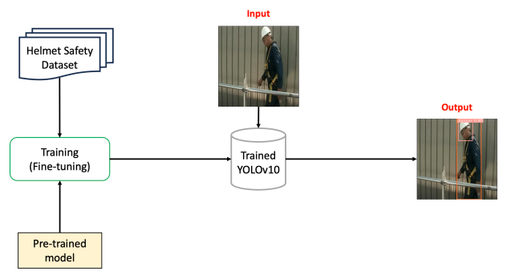

# YOLO-Application-Helmet-Detection
## Purpose
Detect a person to wear helmet or not
* Input: an image
* Output: bounding boxes location of people and helmets

## Pipeline

## How to run the application
### 1. Clone source code

### 2. Download required packages

### 3. Download pretrained model
YOLOv10 provide a pre-trained model that was trained on COCO dataset.

Github link: https://github.com/THU-MIG/yolov10

Install required packages for YOLOv10

`>cd yolov10`

`>pip install -q -r requirements.txt`

`>pip install -e .`

### 4. Download dataset

### 5. Training

### 6. Evaluation

### 7. Inference

## Limitation